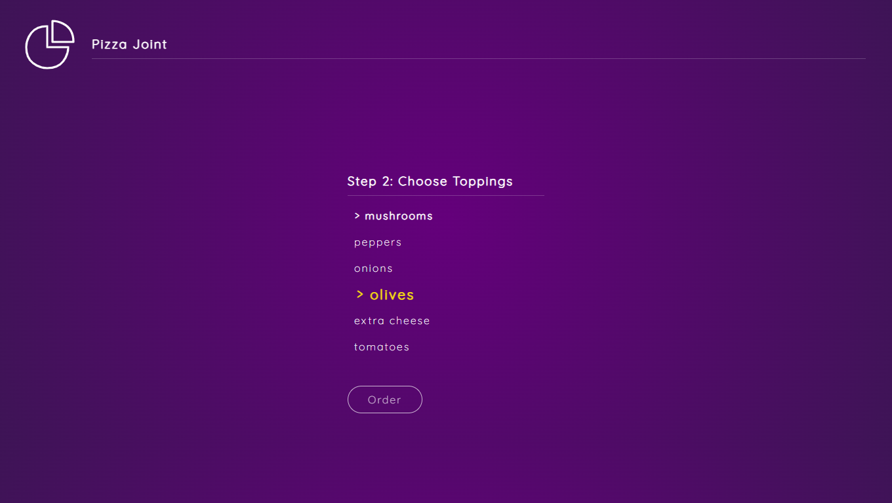

# 🍕 Pizza Joint

A simple React-based pizza ordering system that allows users to browse and order pizzas online with an intuitive interface.

---

## 🚀 Features

- Browse pizzas by category and easily find your favorites
- Customize your pizza with your choice of toppings
- View a summary of your selected items

---

## Getting Started

Follow these instructions to get the project running locally.

### Prerequisites

Make sure you have the following installed:

- [Node.js](https://nodejs.org/) (v14 or higher)
- [npm](https://www.npmjs.com/) (comes with Node.js)

### Installation

1. **Clone the repository**

   ```bash
   git clone https://github.com/rimarayya/pizza-joint.git
   ```

2. **Move to the project file** :

   ```bash
   cd pizza-joint
   ```

3. **Install dependencies**:

   ```bash
   npm install
   # or
   yarn install
   ```

4. **Start the development server**:

   ```bash
   npm run start
   # or
   yarn start
   ```

5. **Build for production**:

   ```bash
   npm run build
   ```

---

## 📸 Screenshot



---

## 📄 License

This project is licensed under the **MIT License**.

---
